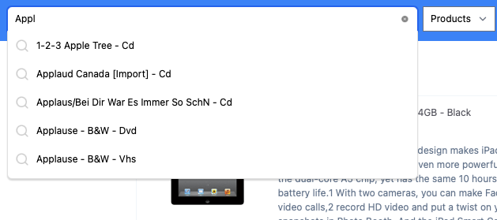

## Lessons from this week's project

- Why have keyword field on text? 
	- Because we want to use the keyword field for aggregations: "Most users who want to do more with text fields use [multi-field mappings](https://www.elastic.co/guide/en/elasticsearch/reference/7.10/multi-fields.html "fields") by having both a `text` field for full text searches, and an unanalyzed [`keyword`](https://www.elastic.co/guide/en/elasticsearch/reference/7.10/keyword.html "Keyword type family") field for aggregations" (more [details](https://www.elastic.co/guide/en/elasticsearch/reference/7.10/text.html#before-enabling-fielddata))

- Difference between match on `name` vs. `name.hyphens`
    - ```
        "name": {
        "type": "text",
        "analyzer": "english",
        "fields": {
          "keyword": {
            "type": "keyword",
            "ignore_above": 2048
          },
          "hyphens":{
            "type": "text",
            "analyzer": "smarter_hyphens"
          }
        }
      },
      ```
    - `name`: A regular text field. When we query "I-phone" on it, the results mostly contain items where the name field contain "-"
    - `name.hypen`:  Also a text field, but with the `smarter_hypens` analyzer which has a (i) tokenizer that only tokenizes on whitespace and newline, and (ii) a filter which concatenates all tokens separated by non-alphanumeric chars (and other good stuff from word delimiter graph token)
        - "i-phone" tokenizes to -> ["i-phone"] and filters to -> ["i-phone", "iphone"]
        - "i phone" tokenizes to -> ["i", "phone"] and filters to -> ["i", "phone"]
        - "iPhone4" tokenizes to -> ["iPhone4"] and filters to ["iphone4", "iphone", "i", "phone", "4"]
        - "Iphone4" tokenizers to ["Iphone4"] and filters to ["iphone4", "iphone", "4"]

- Working with suggesters
  - Writing the query can be tricky. You'll need to add "term" and "phrase" fields before adding the rest of the term suggester or phrase suggester params (more details [here](https://www.elastic.co/guide/en/elasticsearch/reference/7.17/search-suggesters.html#phrase-suggester)).
  - Autocomplete is just a suggester, but it requires setting up your index mappings correctly. In this project, the bbuy product and query data happens to have a field for suggest, but we had to analyze it via trigrams and an english analyzer.


## Project assessment

### Name vs. Name Hyphens

Got the same results. Also see point above on "Difference between match on `name` vs. `name.hyphens`" and `queries.dev` on how to create analyzer and query it with different analyzers.

### Fuzzy Matching 

Got the same results.

### Improving ranking

Did not do (yet).

### Spelling suggestions

Got the same results

### Autocomplete

Got the same results on query suggestions. Somewhat slightly different results for instant search on the apple queries, probably because I didn't implement ranking improvements based on click priors (yet).




